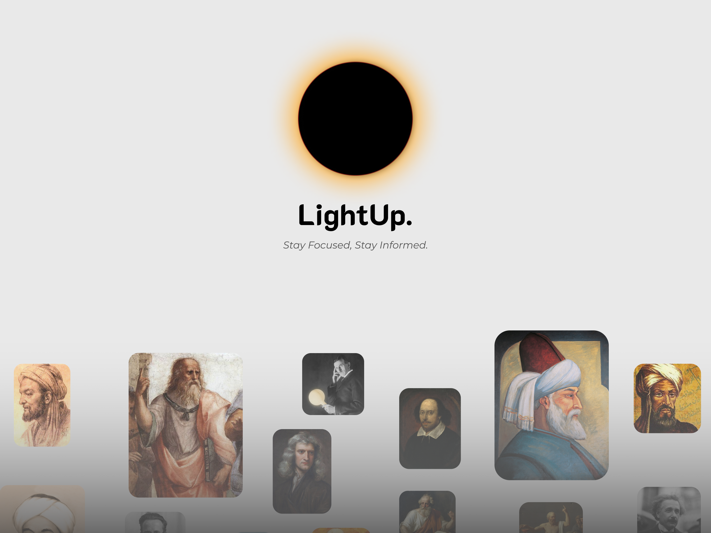

## LightUp : AI-Powered Annotations for every page on the web.

  

## ✨  Meet LightUp
Seamless AI assistance that lives in your browser. No new tabs. No context switching. No interruptions. Just highlight any text and instantly get AI-powered insights.

## ✨ Features

- **Smart Text Analysis**: Get instant explanations for complex text passages

- **Multiple Modes**:
  - 🔍 Explain - Detailed explanations of text
  - 📝 Summarize - Quick summaries of longer content
  - 📊 Analyze - Deep analysis of selected content
  - 🌐 Translate - Translate text into different languages
- **Follow-up Questions**: Ask additional questions about the analyzed content to dive deeper
- **Flexible AI Backend**:
  - Use OpenAI's GPT models
  - Connect to your local LLM (supports llama.cpp, LM Studio, Text Generation WebUI)
  - Grok-beta by xAI
  - Google Gemini Models
    - Gemini 1.0 Pro
    - Gemini 1.5 Pro
    - Gemini 1.5 Flash
- **Dark Mode**.
  

## 📥 Download

Download the latest version of LightUp from our [Releases page](https://github.com/lightup/releases). Choose the appropriate version for your browser and follow the installation instructions below.

## 🚀 Getting Started

## LightUp User Guide

### Installation for users

1. Download the Extension
  - Go to the LightUp Releases
  - Download the latest release ZIP file (lightup-vX.X.X.zip)

2. Install in Chrome/Brave
   - Open Chrome/Brave and go to chrome://extensions/
   - Enable "Developer mode" in the top right corner
   - Drag and drop the downloaded ZIP file into the extensions page
OR click "Load unpacked" and select the unzipped folder.

### Configuration

1. Pin the Extension
   - Click the puzzle piece icon in your browser toolbar
   - Find LightUp and click the pin icon to keep it easily accessible
   - Right-click the LightUp icon and choose "Options" to go directly to Settings
  
2. Choose your preferred AI backend:
   - Local LLM (requires running local serverlocal-llm-download)
   - OpenAI API (requires API key)
   - Google Gemini (requires Gemini API key and model selection)
   - Grok-beta by xAI
3. Save your settings

## 🔧 Usage

1. Select any text on a webpage
2. A LightUp popup will appear
3. Get instant AI-powered insights
4. Ask follow-up questions for deeper understanding

## Keyboard Shortcuts

LightUp supports keyboard shortcuts for quick mode switching:

- `Ctrl+Shift+Z`: Switch to Explain mode
- `Ctrl+Shift+S`: Switch to Summarize mode
- `Ctrl+Shift+A`: Switch to Analyze mode
- `Ctrl+Shift+T`: Switch to Translate mode

After setting the mode via shortcut, simply select any text and LightUp will appear with your chosen mode.

## Switching Modes

You can switch modes in two ways:
1. Using keyboard shortcuts (see above)
2. Clicking the LightUp icon in the toolbar to manually select a mode

This allows you to easily toggle between explaining, summarizing, analyzing, and translating text as per your needs.

## 🛠️ Development

This extension is built with:
- [Plasmo Framework](https://docs.plasmo.com/)
- React + TypeScript
- Framer Motion for animations

## 🌟 Support LightUp

If you've found LightUp helpful and want to see it grow, consider supporting the project! Whether it's through a small donation, a coffee, or sharing with others, every bit helps us continue improving and bringing new features to life.

You can send your support through the following cryptocurrency addresses:

- Bitcoin (BTC): `bc1qfz2ccaqu579xjtfqdhr37k07u6z2g22gzkkfz2`
- Ethereum (ETH): `0xc486F15697FFe7BE07709f2009e032e1d3aC78fA`
- USDT (ERC-20): `0xc486F15697FFe7BE07709f2009e032e1d3aC78fA`

