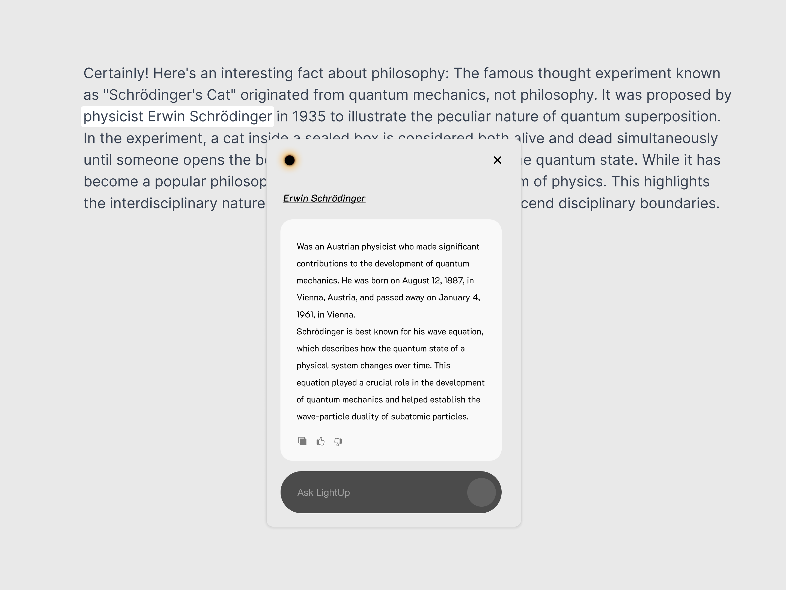

# LightUp - Instant Insights on Any Text

<p align="center">
  
  
</p>

**Meet LightUp** - Seamless AI assistance that lives in your browser. No new tabs. No context switching. No interruptions. Just highlight any text and instantly get AI-powered insights, explanations, and analysis. Whether you're diving into documentation, reviewing code, or working with content in any language, LightUp is there - elegantly integrated into your natural workflow. It's AI that works the way you do.
<p align="center">
  
   
</p>

## ✨ Features

- **Smart Text Analysis**: Get instant explanations for complex text passages
- **Code Understanding**: Quickly grasp code snippets with AI-powered explanations
- **Multiple Modes**:
  - 🔍 Explain - Detailed explanations of text or code
  - 📝 Summarize - Quick summaries of longer content
  - 📊 Analyze - Deep analysis of selected content
- **Follow-up Questions**: Ask additional questions about the analyzed content to dive deeper

- **Flexible AI Backend**:
  - Use OpenAI's GPT models
  - Connect to your local LLM (supports llama.cpp, LM Studio, Text Generation WebUI)
  - Customizable server settings

## 🚀 Getting Started

### Installation

1. Clone this repository:
```bash
git clone https://github.com/your-username/lightup-extension
cd lightup-extension
```

2. Install dependencies:
```bash
pnpm install
# or
npm install
```

3. Run the development server:
```bash
pnpm dev
# or
npm run dev
```

4. Load the extension in your browser:
   - Chrome: Navigate to `chrome://extensions/`
   - Enable "Developer mode"
   - Click "Load unpacked" and select the `build/chrome-mv3-dev` directory

### Configuration

1. Click the LightUp extension icon
2. Go to Settings
3. Choose your preferred AI backend:
   - OpenAI API (requires API key)
   - Local LLM (requires running local server)
4. Save your settings

## 🔧 Usage

1. Select any text or code on a webpage
2. A LightUp popup will appear
3. Choose your desired analysis mode
4. Get instant AI-powered insights
5. Ask follow-up questions for deeper understanding

## 🛠️ Development

This extension is built with:
- [Plasmo Framework](https://docs.plasmo.com/)
- React + TypeScript
- Framer Motion for animations

### Building for Production

```bash
pnpm build
# or
npm run build
```

## 📝 License

[MIT License](LICENSE)

## 🤝 Contributing

Contributions are welcome! Please feel free to submit a Pull Request.

1. Fork the repository
2. Create your feature branch (`git checkout -b feature/AmazingFeature`)
3. Commit your changes (`git commit -m 'Add some AmazingFeature'`)
4. Push to the branch (`git push origin feature/AmazingFeature`)
5. Open a Pull Request

## 🙏 Acknowledgments

- Built with [Plasmo](https://docs.plasmo.com/)
- Powered by OpenAI/Local LLM technology
- Icons and design inspiration from [source]

---

<p align="center">
  Made by [@moesadiq](https://twitter.com/sadiq_moo)
</p>
