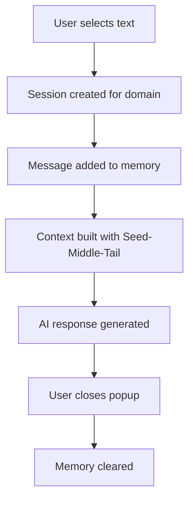
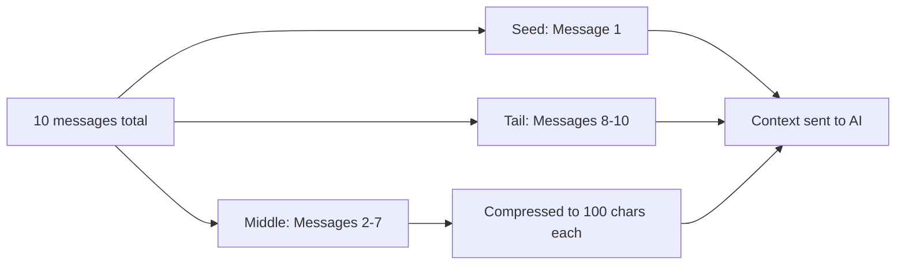
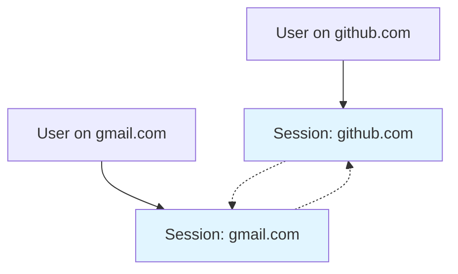

# Privacy-First Session Memory

*How we built LightUp to remember conversations within the same session without ever writing to disk*

---

You select text, ask LightUp to explain it, then follow up with a question. The AI remembers. But what does "memory" actually mean in AI?

There's a common misconception: AI memory is like human memory—something the model "knows" and carries forward. In reality, AI memory is just **context passed to each API call**. When you ask a follow-up question, the system sends your previous conversation along with your new question. The AI doesn't "remember"—it just sees the history you provide.

**Important**: We're talking about session memory only - remembering conversations within the same session. This is different from long-term memory that remembers facts about you across different sessions or days.

Most AI assistants store this conversation history—on servers, in databases, or locally on disk. This creates privacy risks and compliance issues. I took a different approach: LightUp's memory lives only in RAM. When you close the popup, everything is gone.

---

## How Others Solve Session Memory

### ChatGPT's Method

For remembering conversations within the same session, ChatGPT uses:

- **Session info**: Your device and browser for the current session
- **Chat summaries**: Short versions of the current conversation
- **Recent messages**: Last few messages in a sliding window

ChatGPT focuses on speed with lightweight summaries rather than storing every message.

### OpenAI's Developer Tools

For developers building apps, OpenAI provides a simple in-memory system:

```python
class TrimmingSession(SessionABC):
    def __init__(self, session_id: str, max_turns: int = 8):
        self._items: Deque[TResponseInputItem] = deque()
        self.max_turns = max_turns
```

When there are too many messages, older ones get removed or summarized.

**Reference**: [OpenAI Cookbook - Session Memory](https://cookbook.openai.com/examples/agents_sdk/session_memory)

### Common Session Memory Approaches

**Full History**: Send entire conversation to the AI. Simple but expensive and hits context limits quickly.

**Sliding Window**: Keep only the last N messages. Common approach but loses important early context.

**Token-Based Truncation**: Limit by token count instead of message count. Better cost control but still loses context.

**Summarization**: Compress older messages while keeping recent ones. Microsoft and others use this approach, but details get lost in compression.

**Reference**: [LLM Chat History Summarization Guide 2025](https://mem0.ai/blog/llm-chat-history-summarization-guide-2025), [OpenAI Session Memory Cookbook](https://cookbook.openai.com/examples/agents_sdk/session_memory)

### The Problems

- **Stored Forever**: Session data often gets saved to servers or databases
- **Privacy Risks**: Stored session data can be hacked or leaked
- **Hard to Delete**: Difficult to remove all traces of session data

---

## How LightUp Solves It

### The Whiteboard Approach

Imagine most AI assistants use a permanent notebook - they write down every conversation and keep it forever. 

We gave LightUp a whiteboard instead.

When you select text and ask a question, we create a whiteboard for that website. Every message gets written on it. The AI reads the whiteboard to remember context. When you close the popup, we erase the whiteboard completely.

### The Architecture

```typescript
export class SessionMemory {
  private sessions: Map<string, SessionContext> = new Map();
  private currentDomain: string | null = null;
}
```

Each session contains messages, domain (for isolation), and timestamp.



**Reference**: `SessionMemory.ts:67-71`

### Seed-Middle-Tail Algorithm

Instead of keeping all messages, LightUp prioritizes:

1. **Seed**: First message (original selection) - never discarded
2. **Tail**: 3 most recent messages - highest priority
3. **Middle**: Older messages compressed to 100 characters



Configuration: 50 max messages, 2,000 token budget, seed preservation enabled.

**Reference**: `SessionMemory.ts:44-49, 156-207`

### Privacy Guarantees

**Zero Persistence**: No `localStorage`, `IndexedDB`, or server sync. All data lives in RAM via JavaScript's `Map`.

**Domain Isolation**: Each website gets its own memory space. `github.com` never mixes with `gmail.com`.



**Automatic Cleanup**: Cleanup runs every 30 minutes, removing sessions older than 24 hours and limiting to 100 domains max.

**Reference**: `SessionMemory.ts:77-79, 276-296`

---

## Why This Is Better for LightUp

### Browser Extension Context

LightUp runs as a browser extension, which means:
- Users visit many different websites in one session
- Memory should be scoped to the current website
- Users expect privacy when switching between contexts

### Privacy-First Design Philosophy

LightUp is built on the principle that **privacy should be the default**. By using session-only memory:
- No data retention policies needed
- No right-to-deletion requests (nothing to delete)
- No cross-border data transfer concerns
- No data breach impact (nothing to breach)

### Tradeoffs We Accept

**What You Get**:
- Privacy: Zero persistent storage
- Performance: Minimal memory footprint
- Isolation: Domain-scoped sessions
- Transparency: Users can see token usage

**What You Give Up**:
- No cross-session continuity (closing popup wipes memory)
- No cross-device sync
- Limited context (2,000 token budget)

These tradeoffs align with LightUp's use case: quick, in-context AI assistance on any webpage, not long-term conversation history.

---

## Conclusion

LightUp's Privacy-First Session Memory demonstrates that context and privacy aren't opposing forces—they're design constraints that lead to better architecture.

Key insights:
1. **Ephemeral memory can be smart** with seed-middle-tail prioritization
2. **Domain isolation prevents leakage** without sacrificing utility
3. **Zero persistence eliminates entire categories of privacy risk**

As AI becomes more pervasive, the industry will need more systems like this—ones that respect user privacy by design rather than by policy.

---

## References

- LightUp Source: `src/services/conversation/SessionMemory.ts`
- LightUp Source: `src/services/llm/UnifiedAIService.ts`
- OpenAI Agents SDK: [Session Memory](https://cookbook.openai.com/examples/agents_sdk/session_memory)

---

## Tags

#lightup #privacy #ai #memory #browser-extension #typescript
