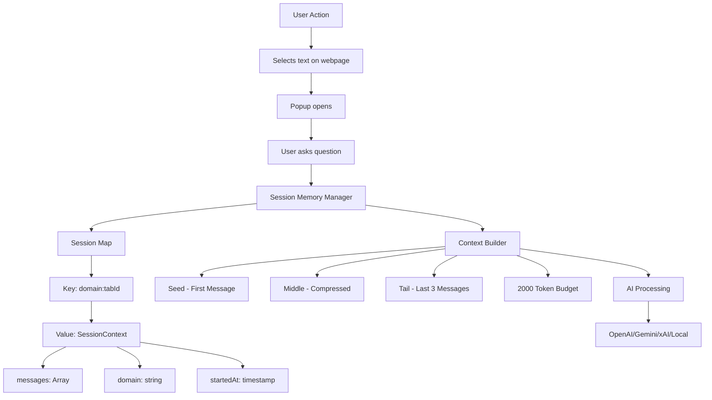
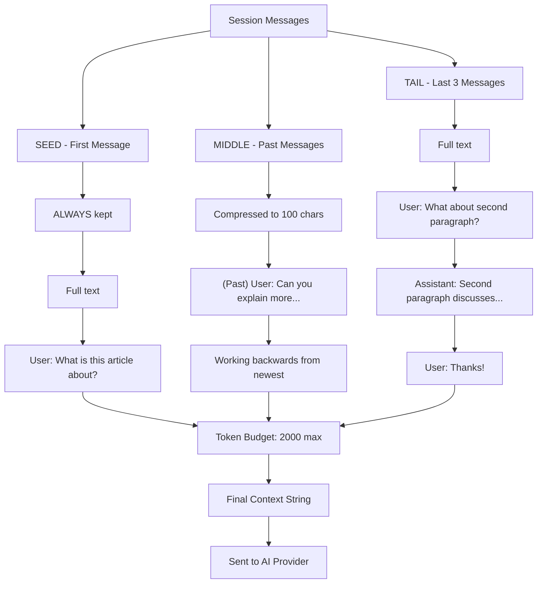
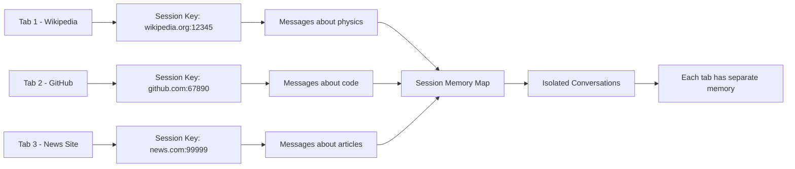
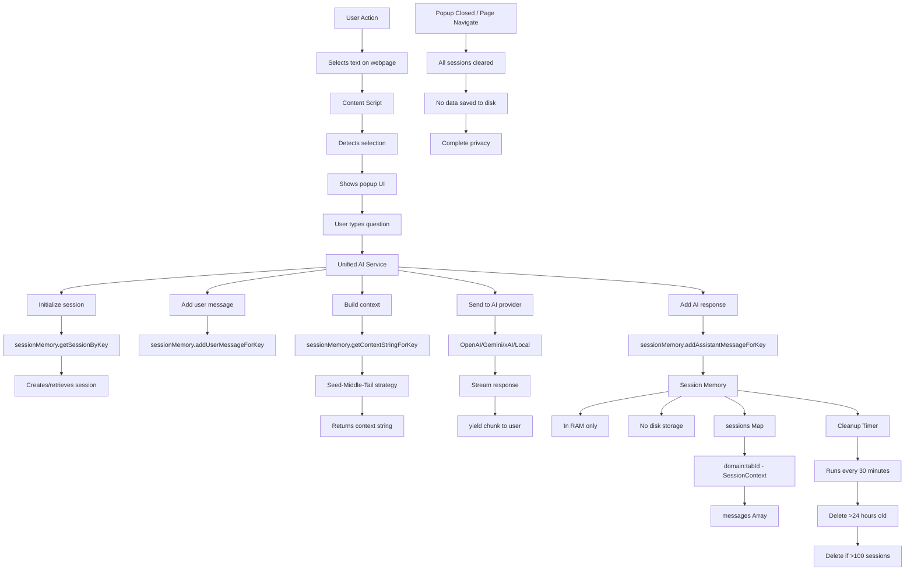

# LightUp Session Memory - Complete Guide

## What is Session Memory?

**Session Memory** is LightUp's privacy-first way of remembering your conversation while you're using the extension. Think of it like your short-term memory - it helps the AI understand what you've been talking about, but it forgets everything as soon as you close the popup or navigate away.

### Key Privacy Principles

1. **NO Persistent Storage** - Data lives ONLY in memory (RAM)
2. **Auto-Clear** - Deleted when popup closes or page changes
3. **No Tracking** - No entity extraction or user tracking
4. **Minimal Retention** - Only keeps what's needed for context

---

## How It Works - The Big Picture



---

## Code Structure Explained

### Main File: `src/services/conversation/SessionMemory.ts`

#### 1. **Types - What Data We Store**

```typescript
// A single message in the conversation
interface SessionMessage {
  role: "user" | "assistant";  // Who sent it
  content: string;             // What they said
  timestamp: number;          // When they said it
}

// A complete session (one conversation on one tab)
interface SessionContext {
  messages: SessionMessage[];  // All messages in this session
  domain: string;              // Website domain (e.g., "example.com")
  startedAt: number;          // When session started
}

// Configuration settings
interface SessionMemoryConfig {
  maxMessages: number;         // Max 50 messages total
  maxTokens: number;          // Max 2000 tokens for context
  seedPreservation: boolean;   // Always keep first message
  tailSize: number;           // Keep last 3 messages in full
}
```

#### 2. **The SessionMemory Class**

```typescript
export class SessionMemory {
  private config: SessionMemoryConfig;
  private sessions: Map<string, SessionContext>;  // Multiple sessions
  private currentDomain: string | null;          // Active session
  private cleanupTimer: NodeJS.Timeout | null;   // Cleanup every 30 min
```

**Key Methods:**

| Method | What It Does |
|--------|--------------|
| `getSession(domain)` | Start or get session for a website |
| `addUserMessage(content)` | Add what user said |
| `addAssistantMessage(content)` | Add what AI said |
| `getContextString()` | Build context string for AI |
| `clearCurrentSession()` | Delete current session (user-triggered) |
| `clearAll()` | Delete ALL sessions |
| `destroy()` | Cleanup when extension closes |

---

## How Messages Flow Through the System

### Step 1: User Asks a Question

```typescript
// In UnifiedAIService.ts
async* processText(request: AIServiceRequest) {
  // 1. Add user message to memory (NOT saved to disk!)
  sessionMemory.addUserMessageForKey(sessionKey, text);
  
  // 2. Build request with context
  const enhancedRequest = this.buildEnhancedRequest(request);
  
  // 3. Send to AI provider
  for await (const chunk of processor(enhancedRequest)) {
    yield chunk;  // Stream response back to user
  }
  
  // 4. Save AI response to memory (NOT saved to disk!)
  sessionMemory.addAssistantMessageForKey(sessionKey, fullResponse);
}
```

### Step 2: Building Context (The Smart Part)

This is where the magic happens. SessionMemory uses **Seed-Middle-Tail** strategy:



```typescript
private buildContextString(session: SessionContext): string {
  const contextParts: string[] = [];
  let currentTokens = 0;

  // 1. SEED - Always include first message (page context)
  if (this.config.seedPreservation && messages.length > 0) {
    const seed = messages[0];
    contextParts.push(this.formatMessage(seed));
    currentTokens += estimateTokens(seedText);
  }

  // 2. TAIL - Last 3 messages in full (working backwards)
  const tailMessages = messages.slice(-this.config.tailSize);
  for (let i = tailMessages.length - 1; i >= 0; i--) {
    const msg = tailMessages[i];
    const tokens = estimateTokens(formatted);
    if (currentTokens + tokens > this.config.maxTokens) break;
    contextParts.unshift(formatted);  // Add to beginning
    currentTokens += tokens;
  }

  // 3. MIDDLE - Compressed to 100 chars each
  const middleMessages = messages.slice(1, -this.config.tailSize);
  for (let i = middleMessages.length - 1; i >= 0; i--) {
    const msg = middleMessages[i];
    const content = msg.content.length > 100 
      ? msg.content.substring(0, 100) + "..."  // Truncate!
      : msg.content;
    const formatted = `(Past) ${msg.role}: ${content}`;
    if (currentTokens + tokens > this.config.maxTokens) break;
    contextParts.unshift(formatted);
    currentTokens += tokens;
  }

  return contextParts.join("\n\n");
}
```

**Why This Strategy?**

- **Seed**: Always knows the original context (what page you're on)
- **Tail**: Recent conversation is most important for follow-ups
- **Middle**: Older stuff is less important, so we compress it
- **Token Budget**: Never exceeds 2000 tokens (saves money, faster)

---

## Privacy Controls

### Automatic Cleanup

```typescript
// Runs every 30 minutes
private cleanupOldSessions(): void {
  const now = Date.now();
  const TTL = 24 * 60 * 60 * 1000;  // 24 hours
  
  // Delete sessions older than 24 hours
  for (const [domain, session] of this.sessions.entries()) {
    if (now - session.startedAt > TTL) {
      this.sessions.delete(domain);
    }
  }
  
  // If too many domains, delete oldest ones
  if (this.sessions.size > 100) {
    const sorted = Array.from(this.sessions.entries())
      .sort((a, b) => a[1].startedAt - b[1].startedAt);
    const toRemove = sorted.slice(0, this.sessions.size - 100);
    toRemove.forEach(([domain]) => this.sessions.delete(domain));
  }
}
```

### Manual Controls

```typescript
// User can clear current session
sessionMemory.clearCurrentSession();

// Or clear everything
sessionMemory.clearAll();

// Called when extension shuts down
sessionMemory.destroy();  // Clears timer + all sessions
```

---

## How It's Used in LightUp

### 1. When You Open the Popup

```typescript
// UnifiedAIService initializes a session
await unifiedAIService.initialize("example.com:12345", settings);
// Creates: sessions["example.com:12345"] = { messages: [], ... }
```

### 2. When You Ask a Question

```typescript
// User message added to memory
sessionMemory.addUserMessageForKey("example.com:12345", "What is this?");

// Context built and sent to AI
const context = sessionMemory.getContextStringForKey("example.com:12345");
// Returns: "User: What is this article about?\n--- Recent Exchange ---..."

// AI response added to memory
sessionMemory.addAssistantMessageForKey("example.com:12345", "This is about...");
```

### 3. Follow-up Questions

```typescript
// For follow-ups, AI can reference past conversation
if (isFollowUp) {
  enhancedSystemPrompt = `${baseSystemPrompt}

## Conversation Context
${sessionContext}

This is a follow-up question. You may naturally reference what was just discussed.`;
}
```

### 4. New Text Selections

```typescript
// For NEW selections, context is used SILENTLY
if (!isFollowUp) {
  enhancedSystemPrompt = `${baseSystemPrompt}

## Background Context (INTERNAL USE ONLY)
${sessionContext}

IMPORTANT INSTRUCTIONS:
- Use this background to give better answers, but NEVER explicitly mention it.
- Do NOT say things like "as we discussed", "given your interest in".
- Treat each new text selection as a fresh, standalone request.`;
}
```

**This prevents "creepy" behavior!** The AI knows your context but doesn't act like it remembers you.

---

## Token Estimation

How do we count tokens? We estimate based on character count:

```typescript
const estimateTokens = (text: string): number => {
  if (!text) return 0;
  
  // Count non-ASCII characters (emojis, Chinese, Arabic, etc.)
  const nonAsciiCount = (text.match(/[^\x00-\x7F]/g) || []).length;
  const asciiCount = text.length - nonAsciiCount;
  
  // 3.5 chars per token for English
  // 1.5 chars per token for non-English (conservative)
  return Math.ceil((asciiCount / 3.5) + (nonAsciiCount / 1.5));
};
```

**Example:**
- "Hello world" → ~3 tokens
- "你好世界" (Chinese) → ~4 tokens
- "Hello 🌍 world" → ~5 tokens (emoji is non-ASCII)

---

## Configuration Defaults

```typescript
const DEFAULT_CONFIG: SessionMemoryConfig = {
  maxMessages: 50,        // Keep up to 50 messages
  maxTokens: 2000,       // 2000 token budget for context
  seedPreservation: true, // Always keep first message
  tailSize: 3,           // Keep last 3 messages in full
};
```

---

## Multiple Sessions Support

SessionMemory can handle multiple conversations at once:



---

## Metrics and Debugging

You can check how much memory is being used:

```typescript
const metrics = sessionMemory.getMetrics();
// Returns:
// {
//   usedTokens: 1234,      // Tokens currently in use
//   totalTokens: 2000,      // Maximum budget
//   isDistilled: true      // Middle messages are compressed
// }
```

---

## Summary: How Session Memory Protects Your Privacy

| Feature | Privacy Benefit |
|---------|----------------|
| **In-Memory Only** | No data written to disk |
| **Auto-Clear** | Deleted when popup closes |
| **No Persistence** | Can't be recovered after session |
| **Session Keys** | Each tab has isolated memory |
| **Token Limits** | Minimal data retention |
| **No Entity Extraction** | Doesn't track people, places, things |
| **Silent Context Usage** | AI knows context but doesn't mention it |

---

## Complete Data Flow Diagram



---

## Key Takeaways

1. **Session Memory is temporary** - Lives only in RAM, deleted when popup closes
2. **Smart context building** - Uses Seed-Middle-Tail strategy to fit within 2000 tokens
3. **Multiple sessions** - Each tab has its own isolated memory
4. **Privacy-first** - No persistence, no tracking, silent context usage
5. **Automatic cleanup** - Old sessions deleted every 30 minutes
6. **User control** - Can clear sessions manually anytime

---

## Common Questions

**Q: Can I recover my conversation after closing the popup?**
A: No! That's the point. SessionMemory is designed to forget everything when you close the popup.

**Q: Does SessionMemory track what websites I visit?**
A: No. It only stores messages during your active session, and deletes them immediately when you're done.

**Q: Why not save conversations like ChatGPT?**
A: LightUp is designed for privacy. Saving conversations would require persistent storage, which could be accessed or leaked.

**Q: Can the AI remember me across different sessions?**
A: No. Each session is isolated. The AI only remembers what you've discussed in the current popup session.

**Q: What happens if I have 50 messages?**
A: SessionMemory keeps the last 50 messages, but when building context, it only uses what fits in the 2000-token budget using the Seed-Middle-Tail strategy.

---

## File Locations

- **Main Implementation**: `src/services/conversation/SessionMemory.ts`
- **Usage in AI Service**: `src/services/llm/UnifiedAIService.ts`
- **Singleton Export**: `export const sessionMemory = new SessionMemory()`

---

## Want to Learn More?

Check out these files in the codebase:
- `src/services/conversation/SessionMemory.ts` - Full implementation
- `src/services/llm/UnifiedAIService.ts` - How it's used
- `src/background/index.ts` - Background service worker integration

---

*Last Updated: 2026*
